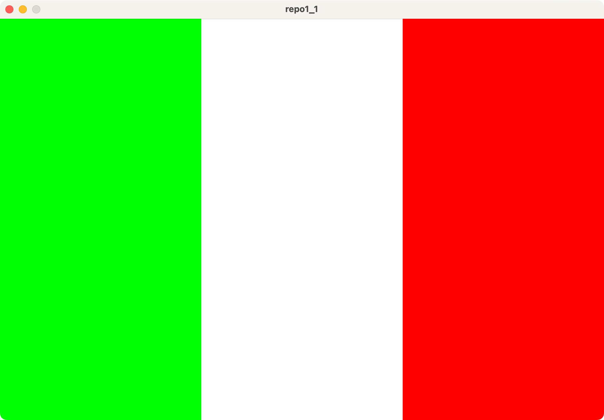
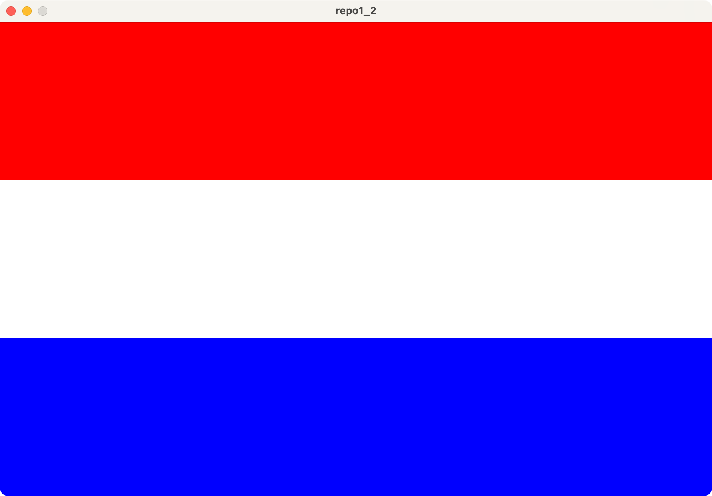
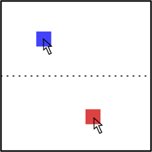

# 2024 情報システム実習 レポート1
## 締め切り: 2024/05/21

### 以下の文章を満たすProcessing-Pythonプログラムを作成してください．

1. イタリアの国旗を書きなさい（縦:横 = 3:2）

2. ルクセンブルクの国旗を書きなさい（縦:横 = 3:2）

3. 以下の図に示すように，マウスが領域の上側にある場合，マウスの位置に青い正方形を描画し，マウスが領域の下側にある場合，マウスの位置に赤い正方形を描画するアニメーションプログラム
（画面サイズは600,600とする）

