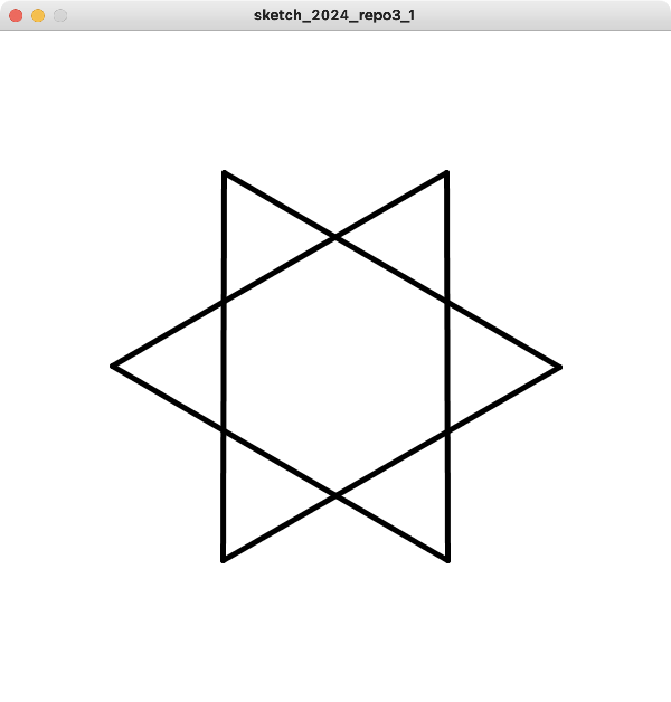
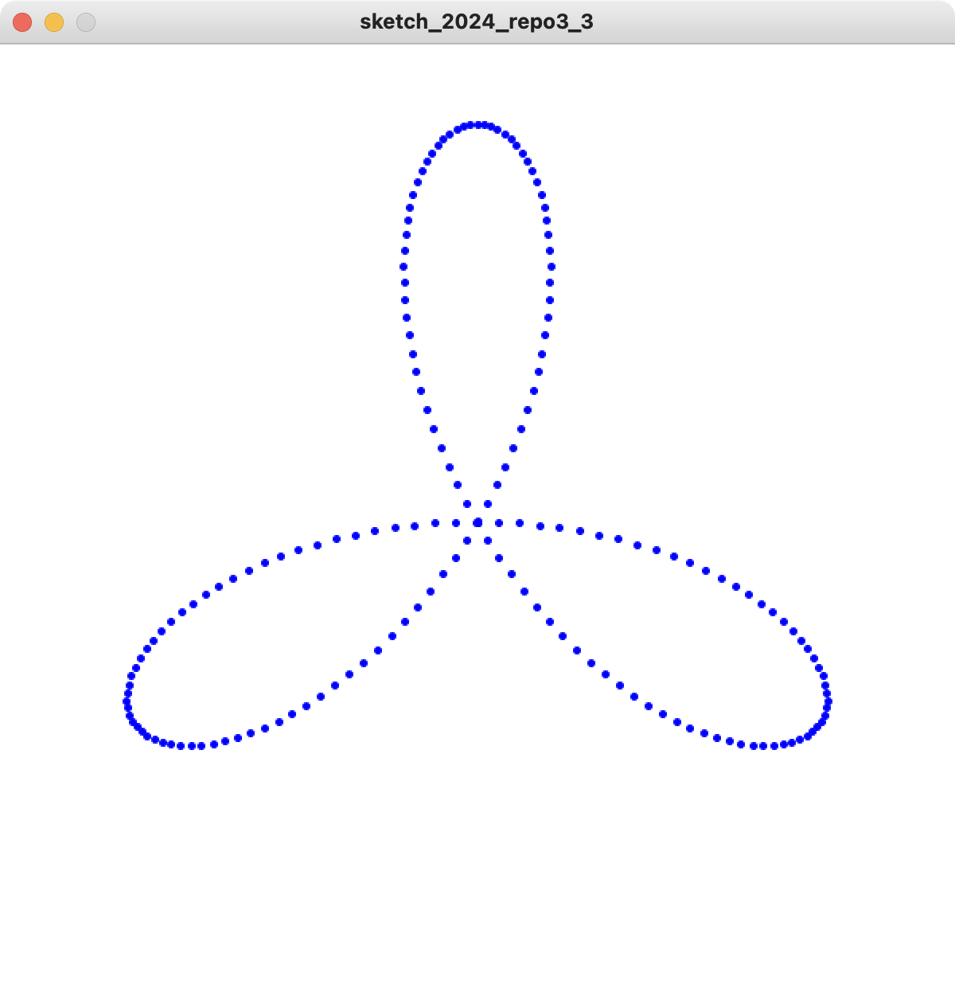

# 2024 情報システム実習 レポート3
## 締め切り: 2024/07/23

### 以下の文章を満たすProcessing-Pythonプログラムを作成してください．

1. 六芒星を描いてください

2. 六芒星が回転するアニメーションを作成しなさい

3. トリフォリウムとよばれる三葉線を描いてください

   - デルトイドの中心($x_{c}$, $y_{c}$)とすると，
    $$x_{c} + a \sin{3\theta}\cos{\theta}$$
    $$y_{c} + a \sin{\theta}\sin{3\theta}$$
   - ただし， $a$ を250にし， $\theta$ を0度から180度まで1度ずつ変化させる
4. トリフォリウムの軌跡アニメーションを作成しなさい
