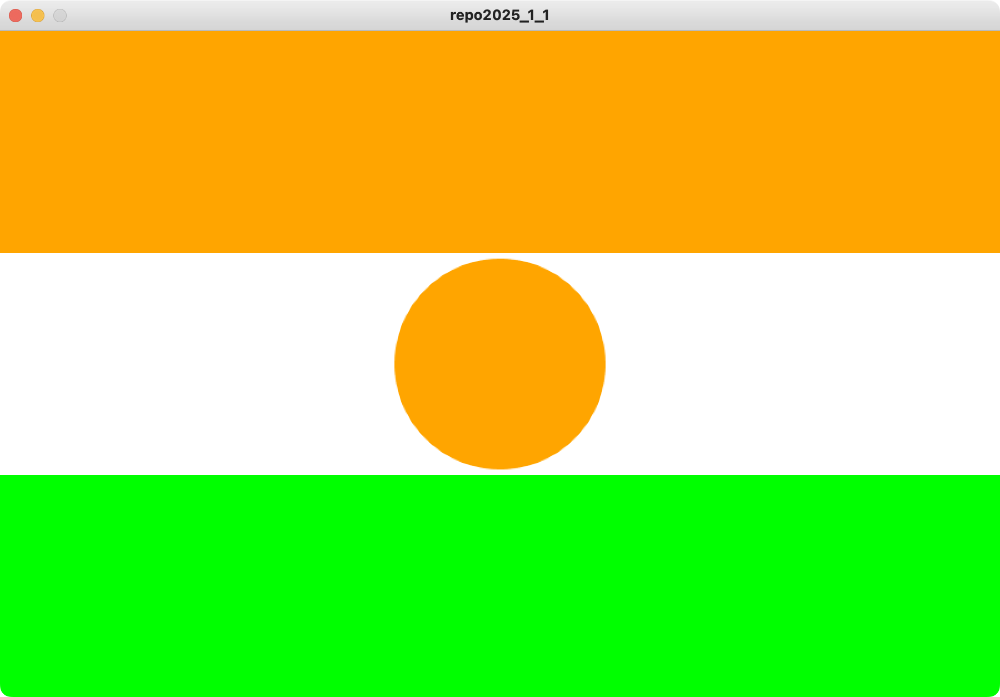
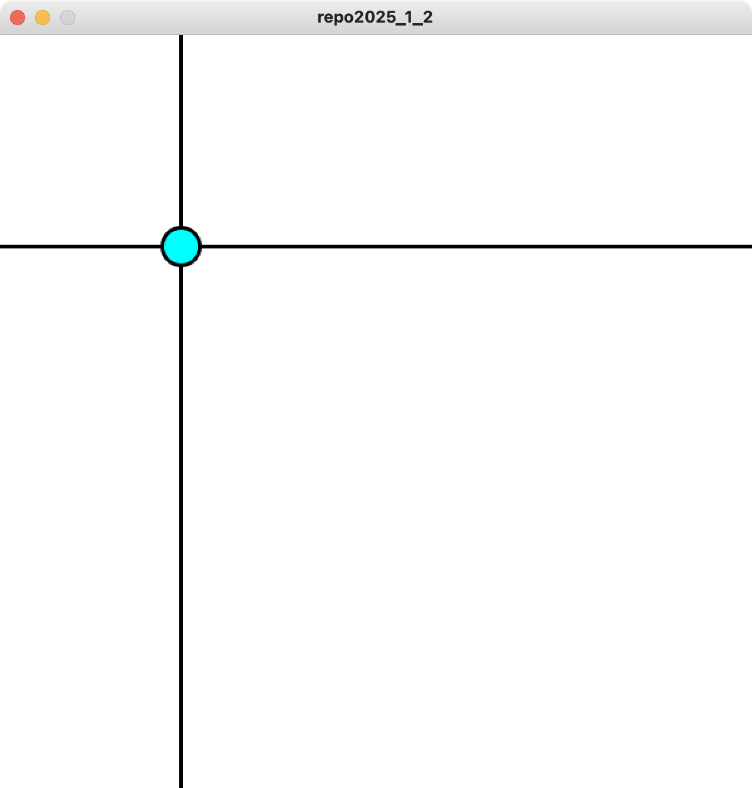
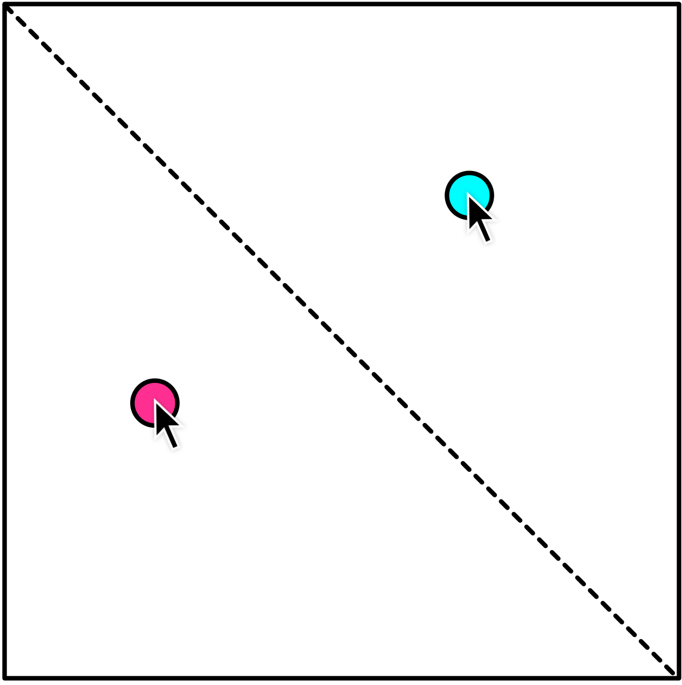

# 2025 情報システム実習 レポート1
## 締め切り: 2024/06/03

### 以下の文章を満たすProcessing-Pythonプログラムを作成してください．

1. ニジェール共和国の国旗を書きなさい（縦:横 = 2:3）
- 使用する色はオレンジと白と緑である
- オレンジのRGBは(255, 165, 0)である

2. 以下の図に示すように，マウスの位置に円を描き，水平方向と垂直方向に放線するアニメーションを作成してください（画面サイズは600, 600とする）

3. 以下の図に示すように，マウスが対角線の上側にある場合，マウスの位置に水色（シアン）の円を描画し，マウスが対角線の下側にある場合，マウスの位置に赤紫（マゼンタ）の円を描画するアニメーションプログラム
（画面サイズは600, 600とする）

