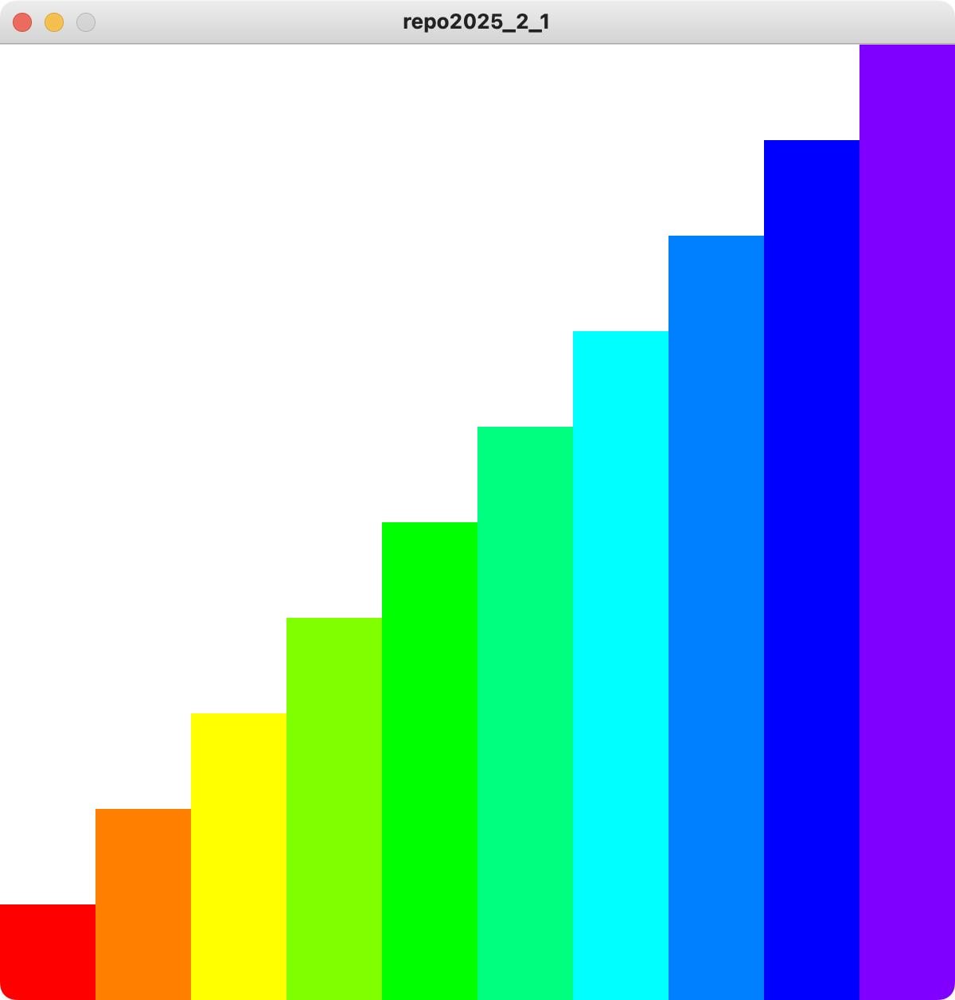
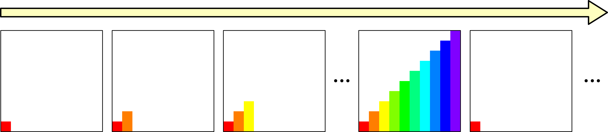
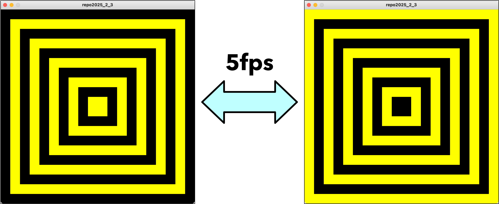

# 2025 情報システム実習 レポート2
## 締め切り: 2025/07/08

### 以下の文章を満たすProcessing-Pythonプログラムを作成してください．

1. 繰り返し処理を利用して，以下の図を書きなさい（画面サイズは600, 600とする）
    - ヒント赤の色相Hは0, 紫の色相Hは270である

2. 以下のアニメーションを作成しなさい．階段を1列ずつ追加して，最初に戻るようにする．（画面サイズは600, 600とする）

3. 以下の図を5fpsで繰り返すアニメーションを作成しなさい．（画面サイズは600, 600とする）

