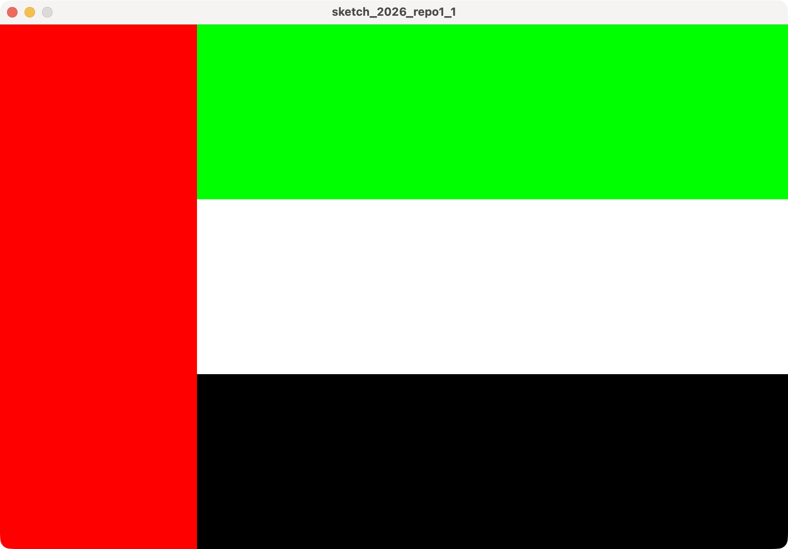
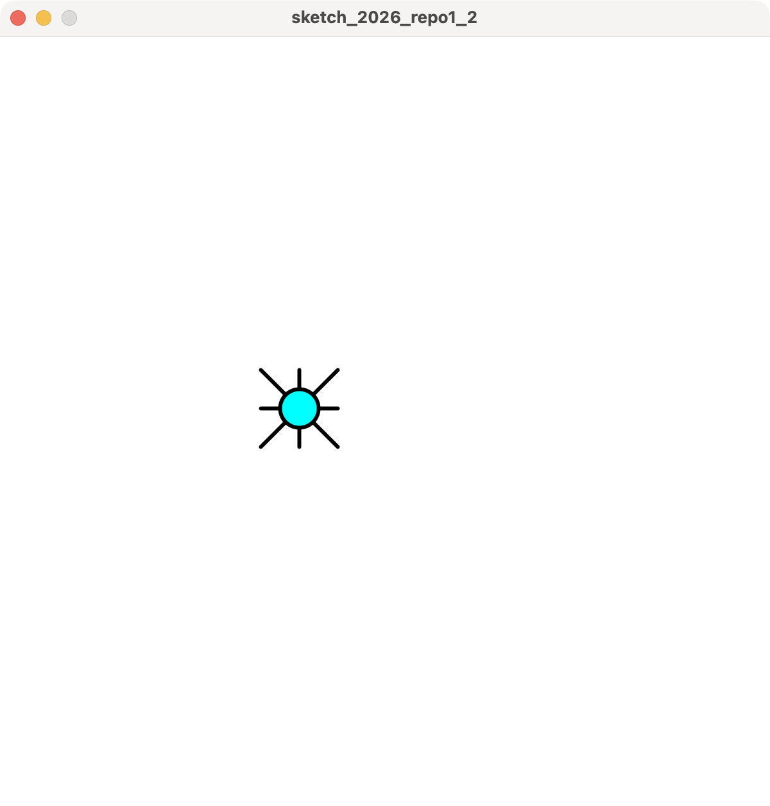
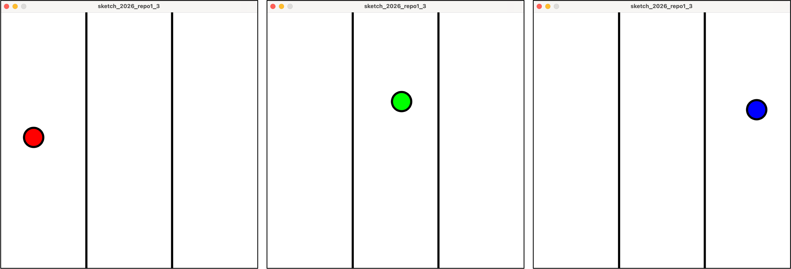

# 2026 情報システム実習 レポート1
## 締め切り: 2026/05/26

### 以下の文章を満たすProcessing-Pythonプログラムを作成してください．

1. アラブ首長国連邦の国旗を描きなさい．（縦:横 = 2:3）
- 使用する色は赤，緑，白，黒である
- この4色は，すべて同じ面積（1:1:1:1）となるようにしなさい

2. マウスの位置を中心から8方向の線分を持つ円を描きなさい．
- マウスの位置に円を描くアニメーションにすること

3. 領域を縦線で3分割し，マウスの位置に円を描くが，領域によって色を変えること．
- 以下の解答例を参考にしなさい（例: 赤，緑，青に変化）
- 

