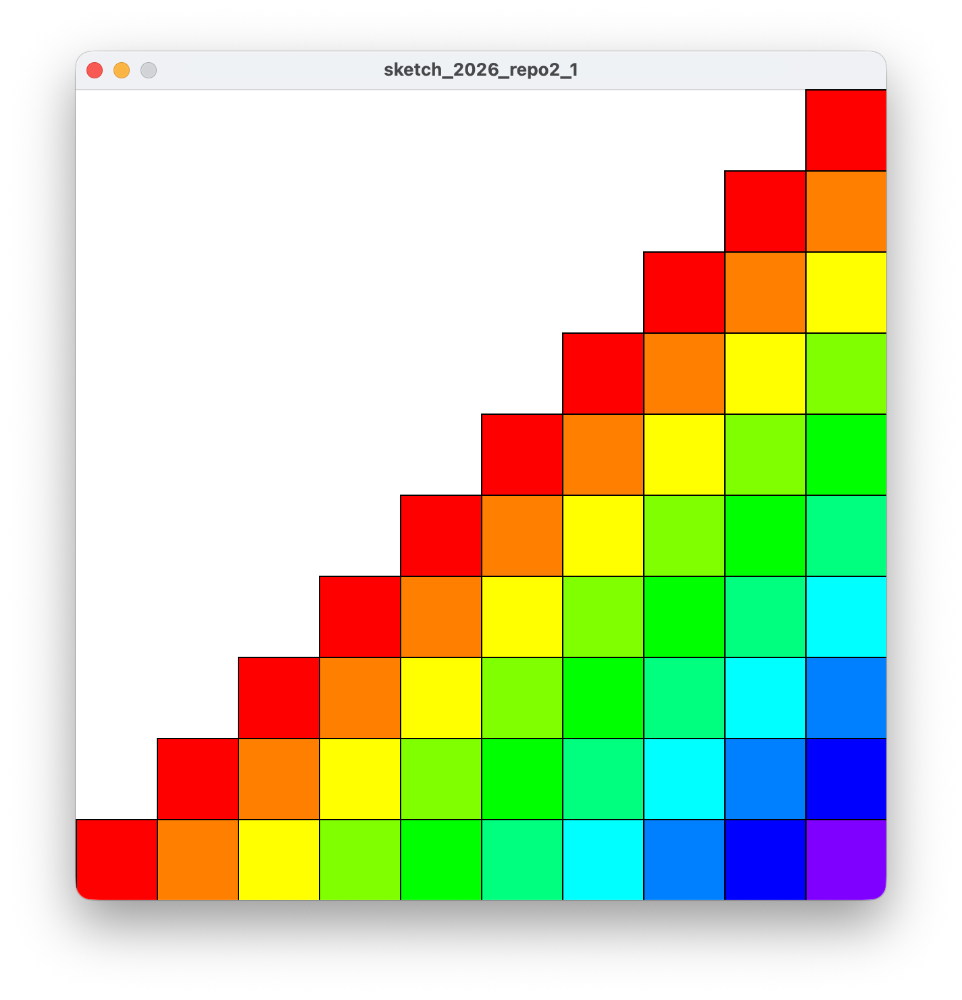
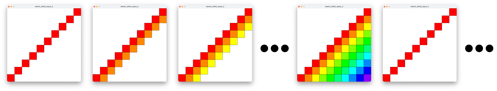
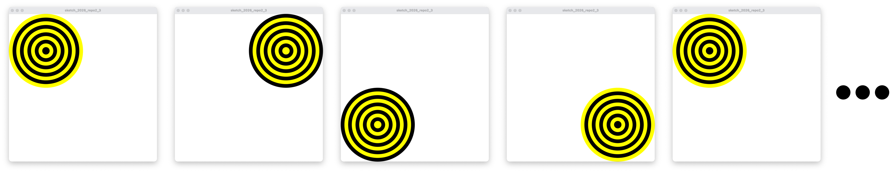

# 2026 情報システム実習 レポート2
## 締め切り: 2026/06/30

### 以下の文章を満たすProcessing-Pythonプログラムを作成してください．

1. 繰り返し処理を利用して，以下の図を書きなさい
  - 画面サイズは600, 600とする
  - ヒント赤の色相Hは0, 紫の色相Hは270である

2. 以下の図のように2fpsで繰り返すアニメーションを作成しなさい．
  - 画面サイズは600, 600とする
  - 斜め方向のある正方形群を順番に増やし，階段全体を表示したら最初に戻る
  

3. 以下の図のように2fpsで繰り返すアニメーションを作成しなさい．
  - 画面サイズは600, 600とする
  - 4枚の画像を順番に表示したら1枚目の画像に戻り，表示を繰り返す．

