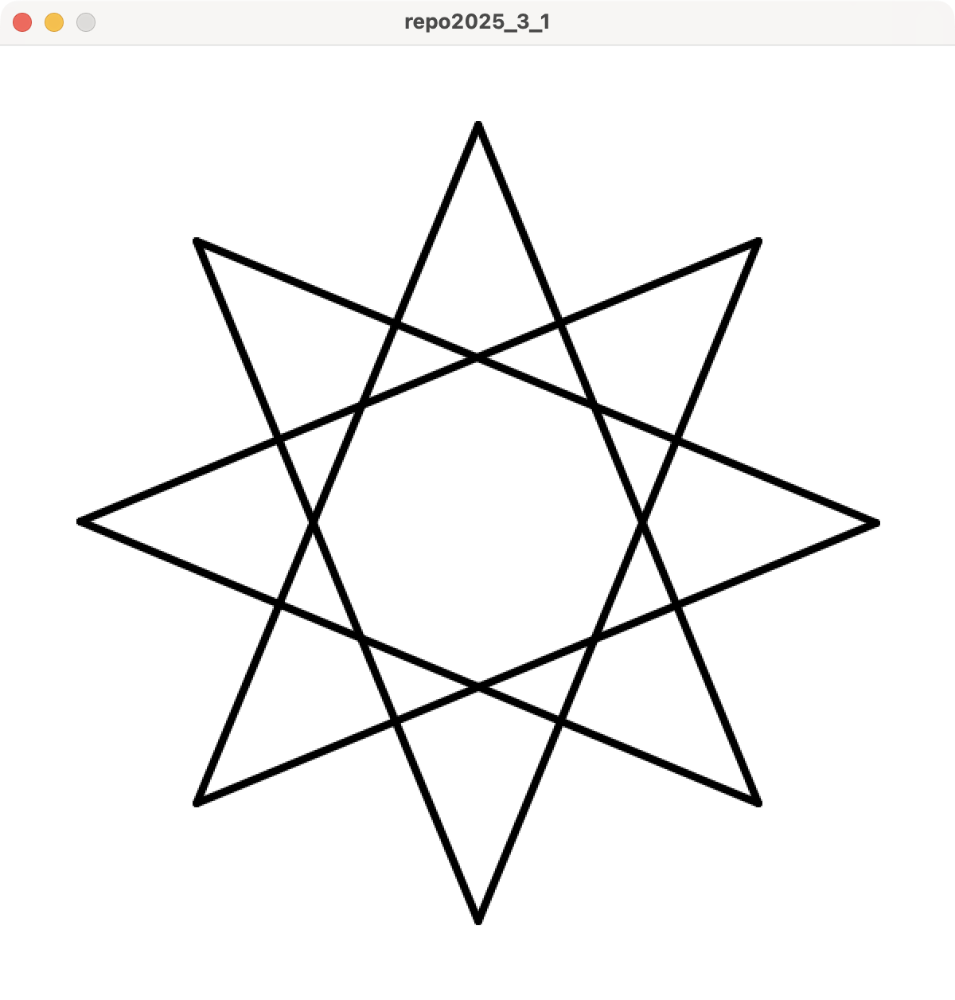
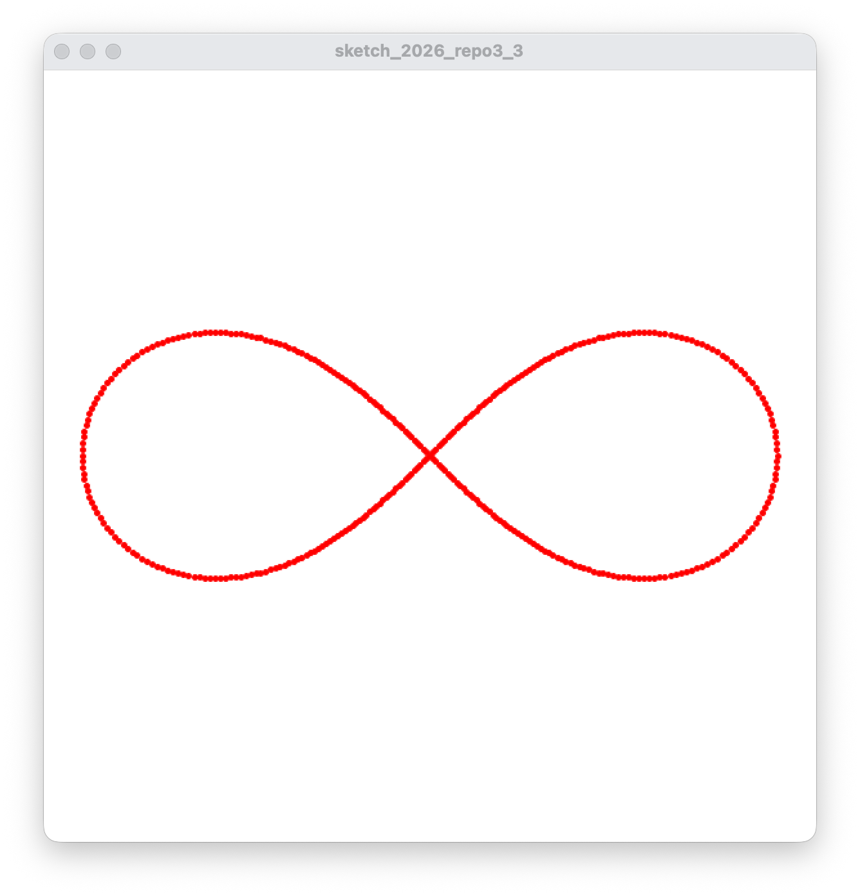

# 2026 情報システム実習 レポート3
## 締め切り: 2026/08/11

- 以下の文章を満たすProcessing-Pythonプログラムを作成してください．
- **ただし，画面サイズを600×600とすること**

1. 大きい円の中に，同じ大きさの円を7つ埋める図を作成してください．

2. 問題1で埋めた円の中で外側にある6つの円を時計回りに回転するアニメーションを作成してください．
   
3. レムニスケートを描いてください

- ヒント
  - レムニスケートの中心を($x_c$, $y_c$)とすると，リサージュ曲線を表現する点($x$, $y$)は，以下のように表現できる
    - $x = x_c + a * \cos(d) / (1+\sin^2(d))$
    - $y = y_c + a * \sin(d) * \cos(d) / (1+\sin^2(d))$
    - ただし， $a$ を270にし， $d$ を0度から360度まで1度ずつ変化させる

4. レムニスケートの軌跡アニメーションを作成しなさい

