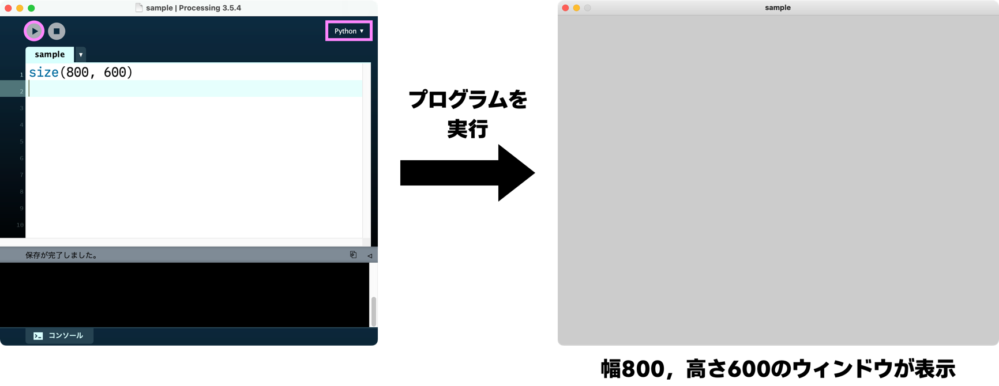

# 第1回目

## Processingプログラミング
### Processingの基礎

#### Processingとは？

- マサチューセッツ工科大学メディアラボが開発した，電子アートやビジュアルデザインを扱いやすい統合開発環境
  - 可視化が簡単なため，初心者でも学びやすい
  - プログラミング言語であるJavaやPythonなどで使用
- この講義で行うこと
  - Processing-Pythonを使った描画プログラミング
  - Processing-Pythonをアニメーションの基礎
  - Processing-Pythonをインタラクションプログラミング
- 基本的にスケッチブックとよばれる統合開発環境に，プログラムを記述して実行する
  - 右上の部分が Python であれば，Pythonで実行できる
  - ▶ をクリックすることで，プログラムを実行できる


# ウィンドウを作成する
- ```size(w, h)```: 幅```w```，高さ```h```のウィンドウを作成する
  - ```w``` : 整数値，幅(ピクセル)
  - ```h``` : 整数値，高さ(ピクセル)
- 例: ```size(600, 400)```
  - 幅600ピクセル，高さ400ピクセルのウィンドウを作成する
- Processingの座標系
  - ウィンドウの左上: 原点
    - 横方向: X軸方向
      - 右向きが正方向
    - 縦方向: Y軸方向
      - 下向きが正方向


# 基本図形描画
- ```point(x, y)```:  座標(```x```, ```y```)に点を描画する
  - 例: ```point(40, 60)``` # 座標(40, 60)に点を描画する
- ```line(x0, y0, x1, y1)```: 座標(```x0```, ```y0```)と(```x1```, ```y1```)を結ぶ線分を引く
  - 例: ```line(20, 20, 40, 40)``` # 座標(20, 20)と座標(40, 40)を結ぶ線分を引く
- ```rect(x, y, w, h)```: 四角形の左上頂点(```x```, ```y```)とし，幅```w```，高さ```h```の長方形を描く
  - 幅と高さを同じ値にすると正方形を描く
  - 例: ```rect(50, 20, 10, 60)``` # 左上の座標(50, 20)と幅10，高さ60の長方形を描く
- ```ellipse(x, y, w, h)```: 中心座標(```x```, ```y```)とし，幅```w```，高さ```h```である楕円を描く
  - 例: ```ellipse(10, 70, 10, 20)``` # 中心の座標(10, 70)と幅10，高さ20の楕円を描く
  - **幅と高さを同じ値にすると円を描く**

# 線・枠線の設定
- ```strokeWeight(w)```: 線（枠線）の太さを```w```に設定する
- ```noStroke()```: 線（枠線）を描画しない設定にする

# 色の設定
- ```stroke(r, g, b)```: 線（枠線）の色を設定
- ```fill(r, g, b)```: 塗りつぶし色を設定
- ```background(r, g, b)```: 背景色を設定

  - 赤成分```r```，緑成分```g```，青成分```b```は**0から255の整数値**とする
  - ```rを0```，```gを0```，```bを0```の場合: **黒色**
    - 例: ```fill(0, 0, 0)``` # 塗りつぶし色を黒にする
  - ```rを255```，```gを255```，```bを255```の場合: **白色**
    - 例: ```background(255, 255, 255)``` # 背景を白にする
  - ```r```を255，gを0，bを0の場合: 赤色
  - ```r```を0，```g```を255，```b```を0の場合: 緑色
  - ```r```を0，```g```を0，```b```を255の場合: 青色
  - ```r```を255，```g```を255，```b```を0の場合: 黄色
  - ```r```を255，```g```を0，```b```を255の場合: マゼンタ（赤紫）色
  - ```r```を0，```g```を255，```b```を255の場合: シアン（緑みの明るい青）色

# 描画の注意
- **プログラムは上から下に順番に実行されるため，最初に描いた図形が最背面，最後に描いた図形が最前面となる**
- 設定した線の太さ，線の色，塗りつぶし色に関しては，設定を変更しない限り，状態が継続される
- ウィンドウを作成した後，ウインドウの幅は```width```，ウインドウの高さは```height```として利用できる
  - これらの値は，Processingが定義している特別なもの
  - ウインドウの中心の座標は```(width/2, height/2)```となる
    - ```+``` : 足し算の意味
    - ```-``` : 引き算の意味
    - ```*``` : 掛け算の意味
    - ```/``` : 割り算の意味
    - ```%``` : 余りの意味

## サンプルプログラム（実行して理解すること）
- 慣れるまで，座標系を紙に書きながら確認をする
### 1
```python
size(800, 600)              # 画面サイズ
point(100, 200)             # 点を描画
line(80, 40, 700, 500)      # 線を描画
rect(200, 300, 400, 200)    # 四角形を描画
ellipse(500, 300, 300, 200) # 楕円を描画
```
### 2
```python
size(640, 480)              # 画面サイズ
background(0, 0, 0)         # 背景色
stroke(255, 255, 31)        # 線の色
fill(31, 127, 255)          # 塗りつぶしの色
strokeWeight(3)             # 線の太さ
point(200, 200)             # 点を描画
line(80, 40, 600, 400)      # 線を描画
rect(300, 200, 200, 100)    # 四角形を描画
ellipse(450, 200, 200, 100) # 楕円を描画
```
### 3
```python
size(600, 600)              # 画面サイズ
background(0, 0, 0)         # 背景色
stroke(255, 0, 255)         # 線の色
strokeWeight(6)             # 線の太さ
line(0, 0, width, height)   # 線を描画
line(width, 0, 0, height)   # 線を描画
```
### 4
```python
size(600, 600)              # 画面サイズ
background(255, 255, 255)   # 背景色
noStroke()                  # 枠線を付けない
fill(0, 255, 255)           # 塗りつぶし
rect(0, 0, width/2, height) # 長方形を描く
```
### 5
```python
size(600, 600)                  # 画面サイズ
background(255, 255, 255)       # 背景色
noStroke()                      # 枠線を付けない
fill(0, 255, 255)               # 塗りつぶし
rect(0, 0, width/2, height)     # 長方形を描く
stroke(0, 0, 0)                 # 線の色
strokeWeight(7)                 # 線の太さ
fill(255, 0, 0)                 # 塗りつぶし
ellipse(450, height/2, 80, 120) # 楕円を描く
```
## 練習問題
1. 日本の国旗を描いてください
  - 国旗の大きさ → 幅 : 高さ = 3 : 2
2. フランスの国旗を描いてください
  - 国旗の大きさ → 幅 : 高さ = 3 : 2
3. ドイツの国旗を描いてください
  - 国旗の大きさ → 幅 : 高さ = 3 : 2
4. スイスの国旗を描いてください
  - 国旗の大きさ → 幅 : 高さ = 1 : 1
