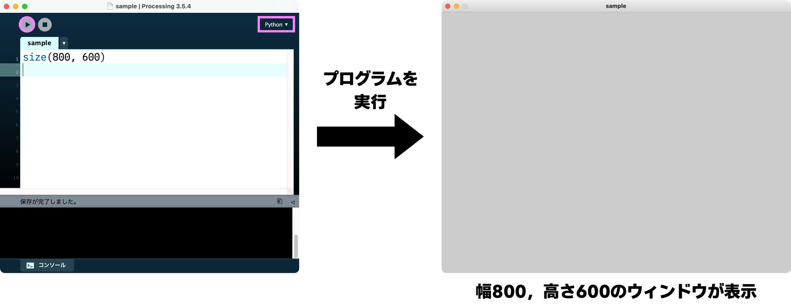
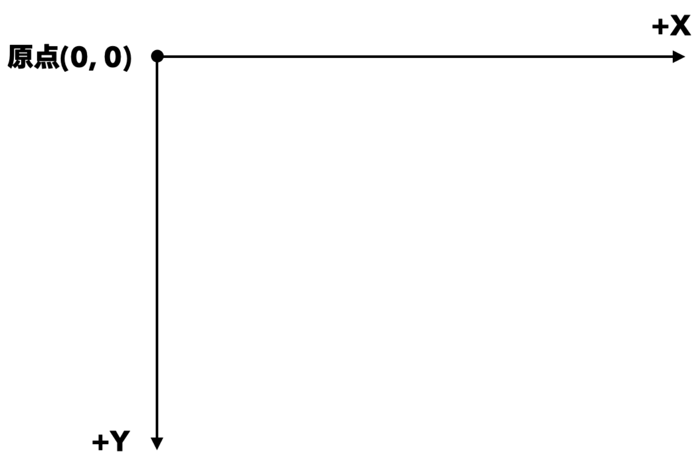

# 第1回

## Processingプログラミング

### Processingの基礎

#### Processingとは？

- **Processing**は，マサチューセッツ工科大学（MIT）メディアラボで開発された，電子アートやビジュアルデザインを扱いやすいプログラミング環境である．
    -   図形やアニメーションを簡単に描くことができるため，**プログラミング初心者でも学びやすい**
    -   JavaやPythonなどの言語を用いてプログラムを書くことができる

#### この講義で行うこと

-   Processing-Python を用いた **描画プログラミング**
-   Processing-Python を用いた **アニメーションの基礎**
-   Processing-Python を用いた **インタラクション（入力を使った）プログラミング**

#### Processingの実行方法

-   Processingでは，**スケッチ（Sketch）と呼ばれる統合開発環境**にプログラムを書いて実行する
-   画面右上の表示が **Python** になっていれば，Pythonモードで実行できる
-   ▶ ボタンをクリックするとプログラムを実行できる



------------------------------------------------------------------------

#### ウィンドウを作成する

- 幅 `w`，高さ `h` のウィンドウを作成する（`w`と`h`は整数値にすること）
  
`size(w, h)`

-   `w` : 幅（ピクセル）
-   `h` : 高さ（ピクセル）

例

``` python
size(600, 400)
```

- 幅600ピクセル，高さ400ピクセルのウィンドウを作成する

#### Processingの座標系

-   ウィンドウの **左上が原点 (0,0)**

- 横方向
    - X軸
    - **右方向が正**

- 縦方向
    - Y軸
    - **下方向が正**



------------------------------------------------------------------------

### 基本図形の描画

#### 点を描く

    point(x, y)

- 座標 `(x, y)` に点を描画する

例

``` python
point(40, 60)
```

------------------------------------------------------------------------

#### 線を描く

    line(x0, y0, x1, y1)

- 座標 `(x0, y0)` と `(x1, y1)` を結ぶ線分を描く

例

``` python
line(20, 20, 40, 40)
```

------------------------------------------------------------------------

#### 長方形を描く

    rect(x, y, w, h)

- 左上の座標 `(x, y)` を基準として幅 `w`，高さ `h` の長方形を描く

例

``` python
rect(50, 20, 10, 60)
```

※ 幅と高さを同じにすると **正方形**になる

------------------------------------------------------------------------

## 楕円

    ellipse(x, y, w, h)

中心座標 `(x, y)` を基準として\
幅 `w`，高さ `h` の楕円を描く

例

``` python
ellipse(10, 70, 10, 20)
```

※ 幅と高さを同じにすると **円**になる

------------------------------------------------------------------------

# 線（枠線）の設定

    strokeWeight(w)

線（枠線）の太さを `w` に設定する

    noStroke()

線（枠線）を描画しない

------------------------------------------------------------------------

# 色の設定

線（枠線）の色

    stroke(r, g, b)

塗りつぶし色

    fill(r, g, b)

背景色

    background(r, g, b)

### RGBカラー

色は **RGB** という3つの値で指定する

-   r : 赤
-   g : 緑
-   b : 青

それぞれ **0〜255の整数**

例

- 塗りつぶし色を黒

``` python
fill(0, 0, 0)
```

- 背景色を白

``` python
background(255, 255, 255)
```

- 代表例
- 
|色|RGB値|
|---|---|
|赤|255,0,0|
|緑|0,255,0|
|青|0,0,255|
|黄|255,255,0|
|マゼンタ|255,0,255|
|シアン|0,255,255|

------------------------------------------------------------------------

# 描画の注意

## 描画順序

プログラムは **上から順に実行される**

そのため

-   先に描いた図形 → **後ろ**
-   後に描いた図形 → **前**

になる

------------------------------------------------------------------------

## 設定は保持される

線の太さや色は，**変更しない限りそのまま継続される**

例

``` python
stroke(255,0,0)
```

とすると，その後の図形はすべて赤になる

------------------------------------------------------------------------

## width と height

ウィンドウを作成すると

    width
    height

という値が自動的に使える

例

ウィンドウ中心

    (width/2, height/2)

------------------------------------------------------------------------

## 四則演算

  記号   意味
  ------ --------
  \+     足し算
  \-     引き算
  \*     掛け算
  /      割り算
  \%     余り

------------------------------------------------------------------------

# サンプルプログラム（実行して理解すること）

慣れるまでは **紙に座標を書きながら確認すること**

------------------------------------------------------------------------

## 1

``` python
size(800, 600)
point(100, 200)
line(80, 40, 700, 500)
rect(200, 300, 400, 200)
ellipse(500, 300, 300, 200)
```

------------------------------------------------------------------------

## 2

``` python
size(640, 480)
background(0, 0, 0)
stroke(255, 255, 31)
fill(31, 127, 255)
strokeWeight(3)
point(200, 200)
line(80, 40, 600, 400)
rect(300, 200, 200, 100)
ellipse(450, 200, 200, 100)
```

------------------------------------------------------------------------

## 3

``` python
size(600, 600)
background(0, 0, 0)
stroke(255, 0, 255)
strokeWeight(6)
line(0, 0, width, height)
line(width, 0, 0, height)
```

------------------------------------------------------------------------

## 4

``` python
size(600, 600)
background(255, 255, 255)
noStroke()
fill(0, 255, 255)
rect(0, 0, width/2, height)
```

------------------------------------------------------------------------

## 5

``` python
size(600, 600)
background(255, 255, 255)
noStroke()
fill(0, 255, 255)
rect(0, 0, width/2, height)
stroke(0, 0, 0)
strokeWeight(7)
fill(255, 0, 0)
ellipse(450, height/2, 80, 120)
```

------------------------------------------------------------------------

# 練習問題

1.  **日本の国旗**を描いてください
    -   国旗の大きさ → 幅 : 高さ = **3 : 2**
2.  **フランスの国旗**を描いてください
    -   国旗の大きさ → 幅 : 高さ = **3 : 2**
3.  **ドイツの国旗**を描いてください
    -   国旗の大きさ → 幅 : 高さ = **3 : 2**
4.  **スイスの国旗**を描いてください
    -   国旗の大きさ → 幅 : 高さ = **1 : 1**
