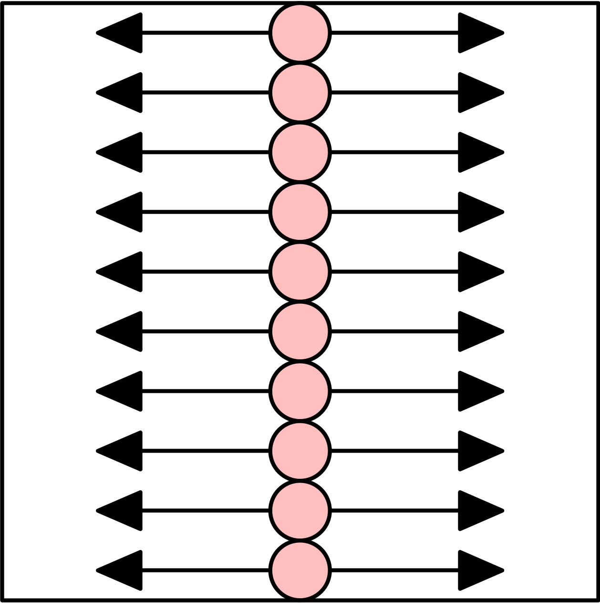

# 第10回目
## 乱数・リスト（基礎）

### 乱数列とは
- ランダムな数列のこと，数列（数の並び）が与えられたときに，次の数字が予測できないもの
  - 1, 2, 3, 4, 5の数列は，次は6が予想されるので乱数列にはならない
  - 1, 3, 5, 7, 9の数列は，次は11が予想されるので乱数列にはならない
- 乱数列を使うことで確率を使用するシミュレーションを行うことができる
  - ただし，乱数列を生成することは困難であるため，人間にとってランダムに見える数である『擬似乱数』を使用する
- 以下のように書くことで，この擬似乱数を使用できる
  - ```random(n)```: 0以上n未満の擬似乱数を生成する
  - ```random(m, n)```: m以上n未満の擬似乱数を生成する


#### 擬似乱数の生成
```python
# 何回も実行してみてください，出力結果が変わります
for i in range(10):
    print(random(1)) # 0以上1未満
```

```python
# 何回も実行してみてください，出力結果が変わります
for i in range(10):
    print(random(2, 4)) # 2以上4未満
```
- 擬似乱数で整数だけを生成したい場合，小数部分を切り捨てれば良い
  - ```int(小数値)```で，その小数の整数部分を取り出すことができる
    - 四捨五入ではなく，切り捨てなので注意
```python
# 何回も実行してみてください，出力結果が変わります
for i in range(10):
    a = random(0, 3) # 0以上3未満
    print(a, int(a)) # 擬似乱数と整数部分を出力（整数部分は0, 1, 2しかとらない）
```

- サイコロは1〜6が出れば良いので，擬似乱数でサイコロの目を出すプログラムを作りたい場合，以下のようになる
```python
for i in range(20):
    dice = int(random(1, 7)) # 1以上7未満の擬似乱数の小数部分を切り捨て
    print(dice) # サイコロの値を出力
```

- 擬似乱数の再現性
  - 擬似乱数を利用したプログラムは実行する度に結果は異なるが，実行の度に毎回異なると使いづらいことがあるため，擬似乱数のシード（種子）を固定をすることで，毎回同じランダムなデータを作成することができる
  - ```randomSeed(整数値)```とすれば良い
    - 整数値を固定することで，毎回同じ擬似乱数が生成される
    - ネットスラングである「乱数調整」は，都合の良いシードを求めることを意味する

```python
# 何回も実行してみてください，同じ出力結果になります
randomSeed(2)
for i in range(10):
    print(random(1)) # 0以上1未満
```

```python
# 何回も実行してみてください，同じ出力結果になります
randomSeed(3)
for i in range(10):
    print(random(2, 4)) # 2以上4未満
```

```python
# 何回も実行してみてください，同じ出力結果になります
randomSeed(4)
for i in range(10):
    a = random(0, 3) # 0以上3未満
    print(a, int(a)) # 擬似乱数と整数部分を出力（整数部分は0, 1, 2しかとらない）
```

```python
# 何回も実行してみてください，同じ出力結果になります
randomSeed(5)
for i in range(20):
    dice = int(random(1, 7)) # 1以上7未満の擬似乱数の小数部分を切り捨て
    print(dice) # サイコロの値を出力
```

```python
# 擬似乱数を利用したプログラム1
size(600, 600)
colorMode(HSB, 360, 100, 100)
background(0, 0, 100)

for i in range(10):
    for j in range(10):
        h = int(random(360))
        # 色をランダムで生成
        fill(h, 100, 100)
        rect(j*60, i*60, 60, 60)
```

```python
# 擬似乱数を利用したプログラム2
x = 0
y = 0

def setup():
    global x, y
    size(600, 600)
    x = width/2
    y = height/2

def draw():
    global x, y
    background(255, 255, 255)
    fill(0, 0, 0)
    ellipse(x, y, 5, 5)
    r = int(random(0, 4))
    if r == 0:
        x += 1
    elif r == 1:
        x -= 1
    elif r == 2:
        y += 1
    else:
        y -= 1
```

```python
# 擬似乱数を利用したプログラム3
def setup():
    size(600, 600)
    strokeWeight(3)
    frameRate(3)

def draw():
    background(255, 255, 255)
    fill(0, 0, 0)
    r = int(random(1, width+1))
    ellipse(width/2, height/2, r, r)
```

```python
# 擬似乱数を利用したプログラム4
d = 0
def setup():
    global d
    size(600, 600)
    d = width/2
    strokeWeight(5)

def draw():
    global d
    background(255, 255, 255)
    ellipse(width/2, height/2, d, d)
    r = int(random(0, 2))
    if r == 0:
        d += 5
    else:
        d -= 5
    d = constrain(d, 1, width)
```

```python
# 擬似乱数を利用したプログラム5
u = 20
threshold = 0.5
size(600, 600)
background(255)
strokeWeight(2)
for i in range(0, height + u, u):
    for j in range(0, width + u, u):
        r = random(1)
        if r > threshold:
            line(j, i, j + u, i + u)
        else:
            line(j, i + u, j + u, i)
```

```python
# 擬似乱数を利用したプログラム6
u = 20
threshold = 0.5
size(600, 600)
background(255)
strokeWeight(2)
for i in range(0, height + u, u):
    for j in range(0, width + u, u):
        r = random(1)
        if r > threshold:
            line(j, i, j + u, i + u)
        else:
            line(j, i + u, j + u, i)
        fill(255, 0, 255)
        ellipse(j, i, 10, 10)
```

### リスト
- 数値や文字列などを並べて格納できるデータ
  - ロッカーや棚に値が格納されているイメージ
  - それぞれの要素を半角コンマ , で区切って，全体を大括弧（角括弧）```[]``` で囲む
- 例えば，```12, 24, 36``` の 3つの数値を格納するリストは以下の通りとなる
  - ```[12, 24, 36]```

### リストとインデックス
- リストの格納されている値を要素とよび，インデックスとよばれる数値を指定して各要素を取得できる
  - 最初の要素（一番左の要素）のインデックス: ```0```
    - ```リスト変数名[0]``` と書けば良い
  - 最後の要素（一番右の要素）のインデックス: ```要素数-1```
    - ```リスト変数名[要素数-1]``` と書けば良い
  - ```リスト変数名[インデックス]```と書くことで，通常の変数に対する処理ができる（代入，演算，更新など）
  - ```print(リスト変数名)``` を実行すると，そのリストの中身が全部表示される
```python
x = [1, 2, 3, 4, 5, 6]
print(x[0])        # 最初の要素のインデックスは0となる
print(x[1])        # 2番⽬の要素のインデックスは1となる
print(x[5])        # 最後の要素のインデックスは「要素数-1」となる
print(x[-1])       # -1をインデックスに指定することで，最後の要素を取得できる
print(x[0] + x[1]) # x[0]とx[1]の和を出力
x[0] = 100         # x[0]の値を100に変更する
x[1] += 200        # x[1]に200を加える
print(x)           # 全要素表示
```

### リストに関する操作
- ```len(リスト変数名)```: リストの要素数を求めることができる
- ```リスト変数名.append(値)```: カッコの中にある値をリストの最後に追加する
- ```リスト変数名.insert(値1, 値2)```: 値2を値1のインデックスの箇所に追加する
  - 元々あったリストは1つずつ後ろにずれる
- ```リスト変数名.remove(値)```: 指定した値をリストから取り除く
  - 複数あった場合，インデックスが一番小さいものを取り除く
- 要素数が0のリスト（空リスト）を作成する場合，```リスト変数名 = []``` と書けばよい
```python
x = [5, 6, 7, 8, 9, 10] # リストの初期化
print(len(x))           # 要素数を表示する
x.append(11)            # 最後の要素に11を追加する
print(x)                # 全要素表示
x.insert(0, 4)          # インデックス0番に4を追加する
x.remove(10)            # リストから10を取り除く
print(x)                # 全要素表示
```
```python
a = []             # 要素数0の空リストを作成する
print(len(a))      # 要素数を表示する
a.append(999)      # 最後の要素に999を追加する
print(a)           # 全要素表示
a.insert(0, -111)  # インデックス0番に-111を追加する
print(a)           # 全要素表示
```
- ```リスト * 整数```とすると，そのリストを整数回連結したリストを生成する
```python
a = [0] * 5
b = [2, 3] * 4

print(a)
print(b)
```

### リストと繰り返し処理
- 数値や文字列などを並べて格納しているため，繰り返し処理と相性がよく，以下の方法で1つずつ値を順番に取り出すことができる

```python
# 各要素にアクセス
x = [1, 2, 3, 4, 5, 6, 7, 8, 9, 10]
for i in x: # iの値がx[0]の値, x[1]の値, ･･･, x[9]の値となる繰り返しとなる
    print(i) 
```
- 繰り返し処理でインデックスを変更させながら格納している要素値を得ることも可能
  - 上のプログラムと同じ結果が得られる
```python
x = [1, 2, 3, 4, 5, 6, 7, 8, 9, 10]
for i in range(len(x)): # 要素数回繰り返す
    print(x[i])         # インデックスを指定する
```

```python
# リストを使用したプログラム1
w = [0] * 10
size(600, 600)
background(255, 255, 255)
for i in range(10):
    w[i] = random(0, width+1)
    rect(0, i*60, w[i], 60)
```

```python
# リストを使用したプログラム2
w = [0] * 10
size(600, 600)
colorMode(HSB, 360, 100, 100)
background(0, 0, 100)
strokeWeight(2)
for i in range(10):
    w[i] = random(0, width+1)
    fill(240, w[i]/width*100, 100)
    rect(0, i*60, w[i], 60)
```

```python
# リストを使用したプログラム3
w = [0] * 10

def setup():
    size(600, 600)
    colorMode(HSB, 360, 100, 100)
    strokeWeight(2)
    frameRate(3)
    for i in range(10):
        w[i] = random(0, width+1)

def draw():
    background(0, 0, 100)
    for i in range(10):
        fill(240, w[i]/width*100, 100)
        rect(0, i*60, w[i], 60)
        # 次の更新
        w[i] = random(0, width+1)
```

### 練習問題
- サンプルプログラムと以下のプログラムを利用して，各問を満たすプログラムを作成しなさい
```python
speed = 3
x = 0
def setup():
    size(600, 600)

def draw():
    global x, speed
    background(255, 255, 255)
    fill(255, 0, 255)
    strokeWeight(5)
    ellipse(x, height/2, 60, 60)
    x += speed
    if x < 0 or x > width:
        speed *= -1
```
1. 衝突する度に，高さの位置が擬似乱数で変わるように変更する（画面に収まるようにする）
2. 衝突する度に，色が擬似乱数で変わるように変更する
3. 衝突する度に，移動速度が擬似乱数で変わるように変更する
4. 以下の図に示すように，リストを使用して複数の円が横移動する（移動速度もそれぞれ擬似乱数で設定）アニメーションになるように変更する



