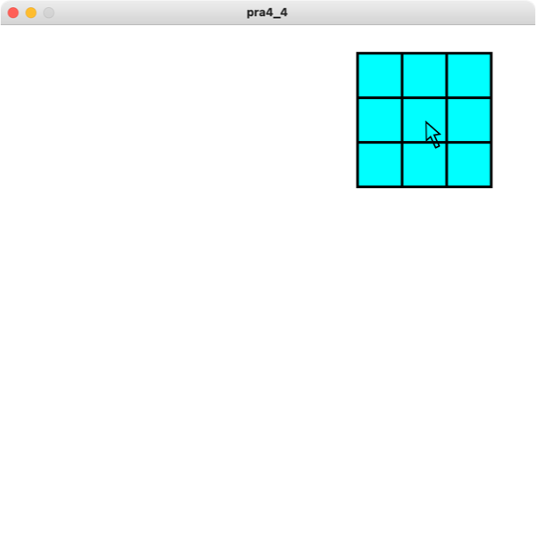

# 第4回目
## Processingによるインタラクション

### アニメーション復習
```python
circleSize = 0
circleX = 100
circleY = 100

def setup():
    size(200, 200)

def draw():
    global circleSize
    background(255, 255, 255)
    stroke(0)
    fill(175)
    ellipse(circleX, circleY, circleSize, circleSize)
    circleSize = circleSize + 1
```


### マウスに関わる特別な変数
- Processingでは，マウスの位置を取得できる特別な変数```mouseX```，
```mouseY```という変数が存在する
    - ```mouseX```: マウスのx座標（横座標）
    - ```mouseY```: マウスのy座標（縦座標）

```python
# サンプルプログラム1
def setup():
    size(200, 200)

def draw():
    circleSize = 30
    background(255, 255, 255)
    strokeWeight(3)
    fill(0, 255, 0)
    ellipse(mouseX, mouseY, circleSize, circleSize)
```

```python
# サンプルプログラム2
def setup():
    size(200, 200)
    background(255, 255, 255)

def draw():
    circleSize = 30
    strokeWeight(3)
    fill(0, 255, 0)
    ellipse(mouseX, mouseY, circleSize, circleSize)
```

```python
# サンプルプログラム3
def setup():
    size(600, 600)

def draw():
    background(255, 255, 255)
    noStroke()
    fill(0, 255, 0)
    rect(0, 0, mouseX, height)
    fill(0, 0, 255)
    rect(mouseX, 0, width-mouseX, height)
```

```python
# サンプルプログラム4
def setup():
    size(600, 600)

def draw():
    background(255, 255, 255)
    strokeWeight(3)
    line(0, 0, mouseX, mouseY)
    line(width, 0, mouseX, mouseY)
    line(0, height, mouseX, mouseY)
    line(width, height, mouseX, mouseY)
    fill(0, 255, 255)
    ellipse(mouseX, mouseY, 30, 30)
```

```python
# サンプルプログラム5
def setup():
    size(600, 600)

def draw():
    background(255, 255, 255)
    strokeWeight(3)
    fill(0, 0, 255)
    ellipse(mouseX, mouseY, 30, 30)
    ellipse(mouseX-30, mouseY, 30, 30)
    ellipse(mouseX+30, mouseY, 30, 30)
    ellipse(mouseX, mouseY-30, 30, 30)
    ellipse(mouseX, mouseY+30, 30, 30)
```

```python
# サンプルプログラム6
def setup():
    size(600, 600)

def draw():
    circleSize = 50
    background(255, 255, 255)
    strokeWeight(3)
    fill(255, 255, 0)
    ellipse(mouseX, mouseY, circleSize, circleSize)
    line(mouseX-circleSize/2, mouseY, mouseX+circleSize/2, mouseY)
    line(mouseX, mouseY-circleSize/2, mouseX, mouseY+circleSize/2)
```

## 練習問題
- サンプルプログラムを参考に，大きさ600, 600の画面に対して，以下のプログラムを書きなさい
  1. マウスの位置に応じて領域を2つに分割する（境界線は横方向とし，各領域に色を付ける）
    
    
  2. マウスの位置に応じて領域を4つに分割する（境界線は十字方向，各領域に色を付ける）
    

  3. マウスの位置に正方形を書くアニメーション
    

  4. マウスの位置に9個の正方形を書くアニメーション（図のように3×3の正方形を書くこと）
    

  5. マウスの位置に4個の正方形を書くアニメーション（図のように2×2の正方形を書くこと）
    