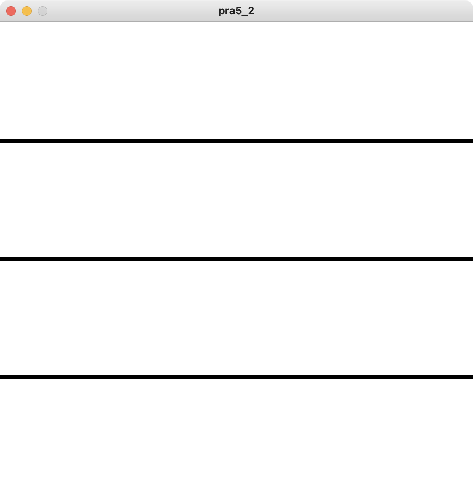
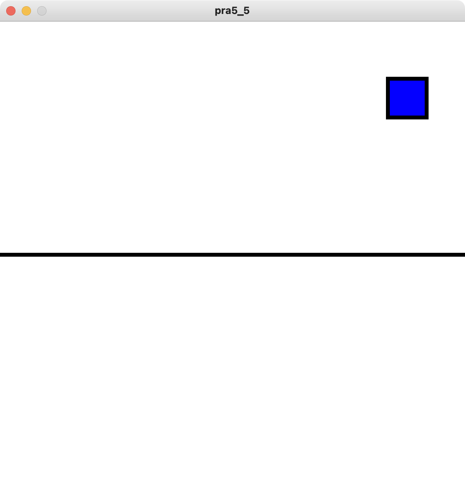

# 第5回目
## 条件分岐を使用したアニメーション（基礎編）

### 条件分岐
- 条件によって処理が異なるプログラムを作成する
  - 例1:「700円以上なら，くじを引く」
  - 例2:「80点以上なら，スコアAと表示する」
  - 例3:「20km以上40km未満なら，中距離である」
- 条件を「満たしている場合」，「満たしていない場合」を，真偽値(```True```/```False```)を使用して，プログラムを作成する
  - 条件を満たしている場合: ```True```， 条件を満たしていない場合: ```False``` とする

### 比較演算子
- 2つの数字や文字列の比較を行うときに使用する演算子
  - 加算や減算などの代数演算子よりも後に計算する
- この比較演算子を使用して条件分岐を行う

| 比較演算子 | 数学的記号 | 意味 | 
|-----|------|----| 
| ==  | =    | 等しい | 
| !=  | ≠    | 等しくない | 
| <   | ＜    | より小さい | 
| >   | ＞    | より大きい | 
| <=  | ≦    | 以下 | 
| >=  | ≧    | 以上 | 

### 条件分岐
- 「700円以上なら，くじを引く」の条件をプログラムで表現する
- 以下の例のように，変数と比較演算子を使用して『条件式』を記述する
  - 条件式を満たしている場合: ```True```
  - 条件式を満たしていない場合: ```False```


```python
# 条件式がTrueの場合
cost = 800
print(cost >= 700) # costは800(700以上)であるので，Trueとなる
```

```python
# 条件式がFalseの場合
cost = 100
print(cost >= 700) # costは100であるので，700以上とはならない
# つまり，条件式を満たさないのでFalse
```

```python
# 『スコアが80点以上なら』の条件式の書き方
# Trueの場合
score = 90
score >= 80
```

```python
# 『スコアが60点未満なら』の条件式の書き方
# Falseの場合
score = 90
score < 60
```

### if文
- 条件分岐を行うためには```if```文を記述する
  - ```if```文で記述されている条件式を満たしている(```True```)の場合，```if```文の直後のコードブロックの処理が実行される
    - コードブロック: 字下げされている部分
  - 条件を満たしていない(```False```)の場合，コードブロックの処理が実行されない

```python
if 条件式:
    # Trueの場合の処理を
    # コードブロック内に書く
```
- 条件式の後に，コロン ```:``` を忘れずに，記述する


```python
# 偶数判定プログラム例
# print()箇所がコードブロック
x = 10
if x % 2 == 0:
    print('even number') # 偶数
```

```python
# 偶数判定プログラム例
# print()箇所がコードブロック
x = 9
if x % 2 == 0:
    print('even number') # 偶数
# 条件を満たしていないので，何も表示されない
```

### コードブロック
- 条件分岐は1行以上のひとまとまりのコードブロックで表現
- Pythonでは，コードを字下げ（インデント）することで，コードブロックを作成可能
  - 字下げ: 行の先頭に決まった数の半角スペースを入力する
  - Pythonは字下げを判断して，プログラムを実行するため，ブロック化がきちんとできていない場合，プログラムが意図した動作をしない（エラーとなることもある）
- 全角スペースを入力しないように注意
  - 全角スペースは見つかりづらいエラーの原因の1つ

```python
x = 0
if x == 1:
    # if文のコードブロック開始
    print('A')
    # if文のコードブロック終了
print('AA') # この行はif文に関係ないので実行される
```

```python
x = 0
if x == 1:
    # if文のコードブロック開始
    print('A')
    print('AA')
    # if文のコードブロック終了
# 条件を満たしていないため，何も表示されない
```

### if-else文
- ```if```-```else```文は，```if```文の条件式に応じて実行される処理が異なる
  - 条件式を満たす(```True```)場合
    - ```if```文に続くコードブロックの処理が実行
  - 条件を満たさない(```False```)の場合
    - ```else```文に続くコードブロックの処理が実行

```python
if 条件式:
    # Trueのときの処理
else:
    # Falseのときの処理
```
- 条件式の後に，コロン ```:``` を忘れずに，記述する
- ```else```文を書く際には，条件式は不要となる
- if-else文は必ずどちらかの処理が実行される

```python
# 偶数奇数判定プログラムの例
x = 10
if x % 2 == 0:
    print('even number') # 偶数
else:
    print('odd number')  # 奇数
# 条件式を満たす（True）ので，ifの後が実行
```

```python
# 偶数奇数判定プログラムの例
x = 9
if x % 2 == 0:
    print('even number') # 偶数
else:
    print('odd number')  # 奇数
# 条件式を満たさない（False）ので，elseの後が実行
```

### if-elif-else文
- 3つ以上の条件分岐（多分岐）に使用したい場合，```elif```文を使用する
  - ```if```文や他の```elif```文に続けて記述する
  - ```elif```文は```if```文と同様に条件式が必要
  - 上から条件式チェックを行い，```True```になったときの処理を行う
    - 下にある条件式チェックは，上に書かれている条件式が```False```のときに行われる
  - どの条件式を```False```の場合，```else```文の処理を行う
    - この場合，```else```文が無い場合は，何も処理を行わない

### constrain文 
- 変数名 = constrain(同じ変数名, 最小値, 最大値)とすることで，その変数が最小値より小さい場合は指定した最小値にし，その変数が最大値より大きい場合は指定した最大値にする
- ```a = constrain(a, 0, 255)```とすると，変数```a```は0から255の値に納まる
  - aが0より小さい場合，0となる
  - aが255より大きい場合，255となる

```python
if 条件式1:
    # 条件式1がTrueのときの処理
elif 条件式2:
    # 条件式1がfalseで，条件式2がTrueのときの処理
elif 条件式3:
    # 条件式1〜2がfalseで，条件式3がTrueのときの処理
else:
    # 条件式1〜3が全てFalseのときの処理
```
- 条件式の後に，コロン ```:``` を忘れずに，記述する
- ```else```文を書く際には，条件式は不要となる
  - ```if```文，```elif```文は条件式が必要となる

```python
# サンプルプログラム1
def setup():
    size(600, 600)

def draw():
    background(255, 255, 255)
    if mouseX <= mouseY:
        background(0, 0, 0)
    strokeWeight(5)
    line(0, 0, width, height)
```
```python
# サンプルプログラム2
def setup():
    size(600, 600)

def draw():
    if mouseX >= width/2:
        background(255, 255, 255)
    else:
        background(0, 0, 0)
    strokeWeight(5)
    line(width/2, 0, width/2, height)
```

```python
# サンプルプログラム3
def setup():
    size(600, 600)

def draw():
    colorMode(HSB, 360, 100, 100)
    if mouseX <= width/3:
        background(0, 100, 100)
    elif mouseX <= 2*width/3:
        background(120, 100, 100)
    else:
        background(240, 100, 100)
    strokeWeight(5)
    line(width/3, 0, width/3, height)
    line(2*width/3, 0, 2*width/3, height)
```

```python
h = 0
# サンプルプログラム4
def setup():
    size(600, 600)

def draw():
    global h
    colorMode(HSB, 360, 100, 100)
    background(h, 255, 255)
    if mouseX >= width/2:
      h += 1
    else:
      h -= 1
    strokeWeight(5)
    line(width/2, 0, width/2, height)
    h = constrain(h, 0, 240)
```

## 練習問題
- サンプルプログラムを参考に，大きさ600, 600の画面に対して，以下のプログラムを書きなさい
  1. マウスのy座標位置に応じて画面の背景色を変更する（2分割）
  
  2. マウスのy座標位置に応じて画面の背景色を変更する（4分割）
  
  3. マウスの位置に応じて画面の背景色を変更する（境界線は，右上から左下の対角線）
  
  4. マウスの位置に正方形を書き，マウスのx座標に応じて色変更する
   - 真ん中より左側にあると赤くなり，真ん中より右側にあると青くなる
  
  
  5. マウスの位置に円を書き，マウスのy座標に応じて色変更する
   - 真ん中より上側にあると青くなり，真ん中より下側にあると赤くなる
  
  
