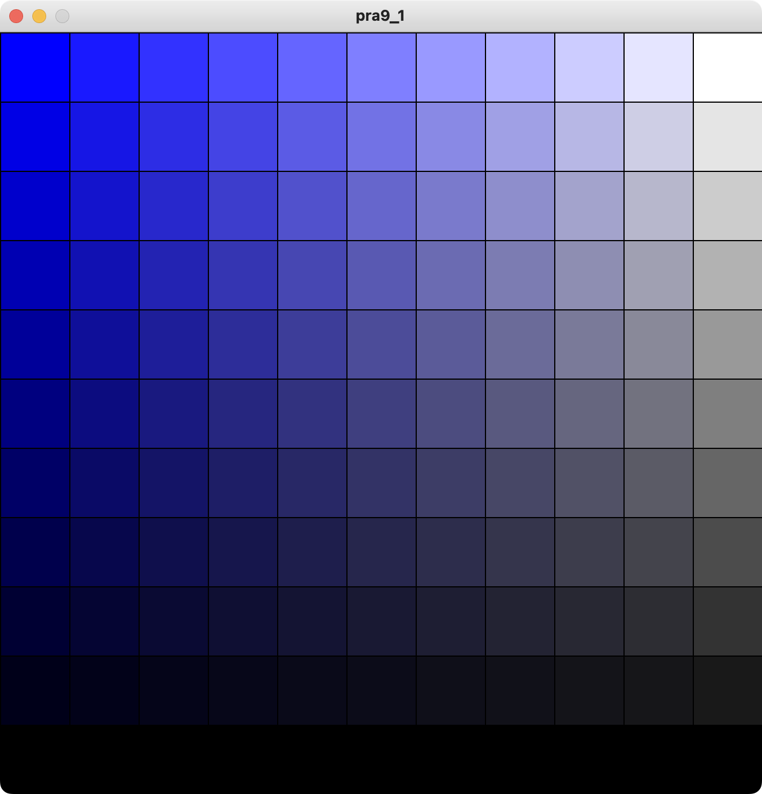
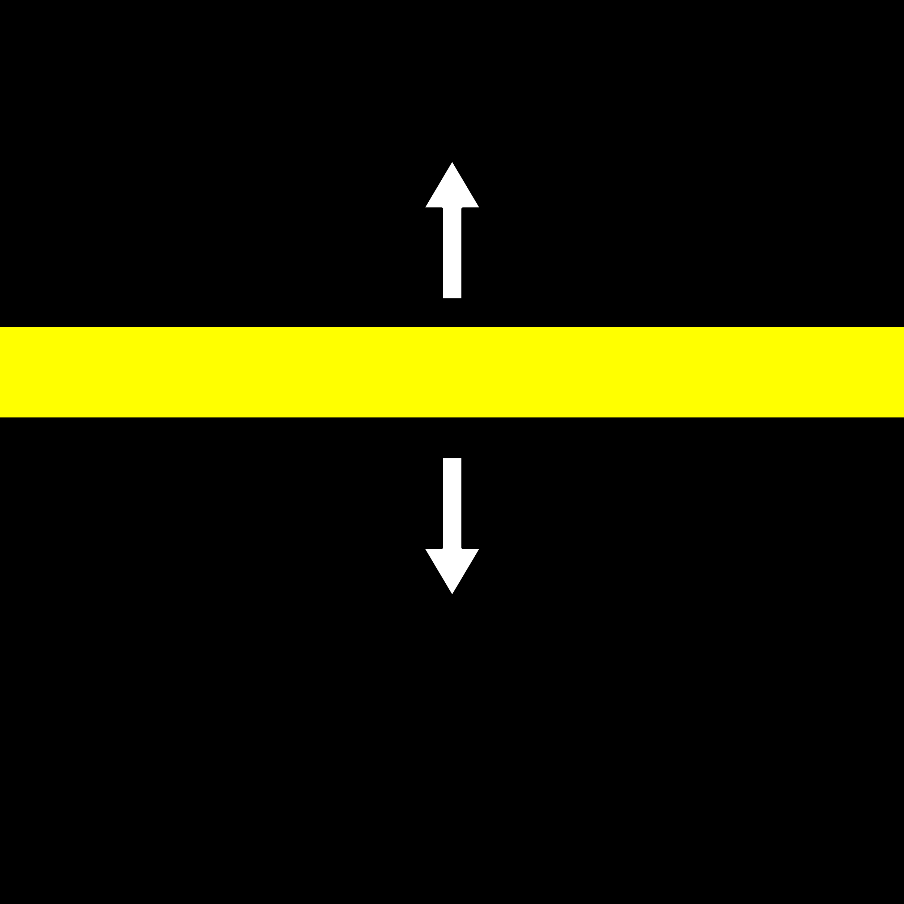
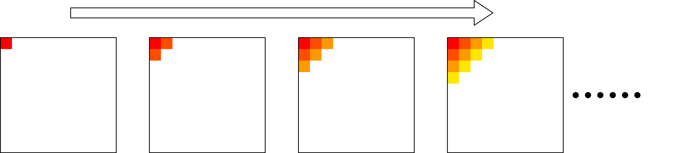
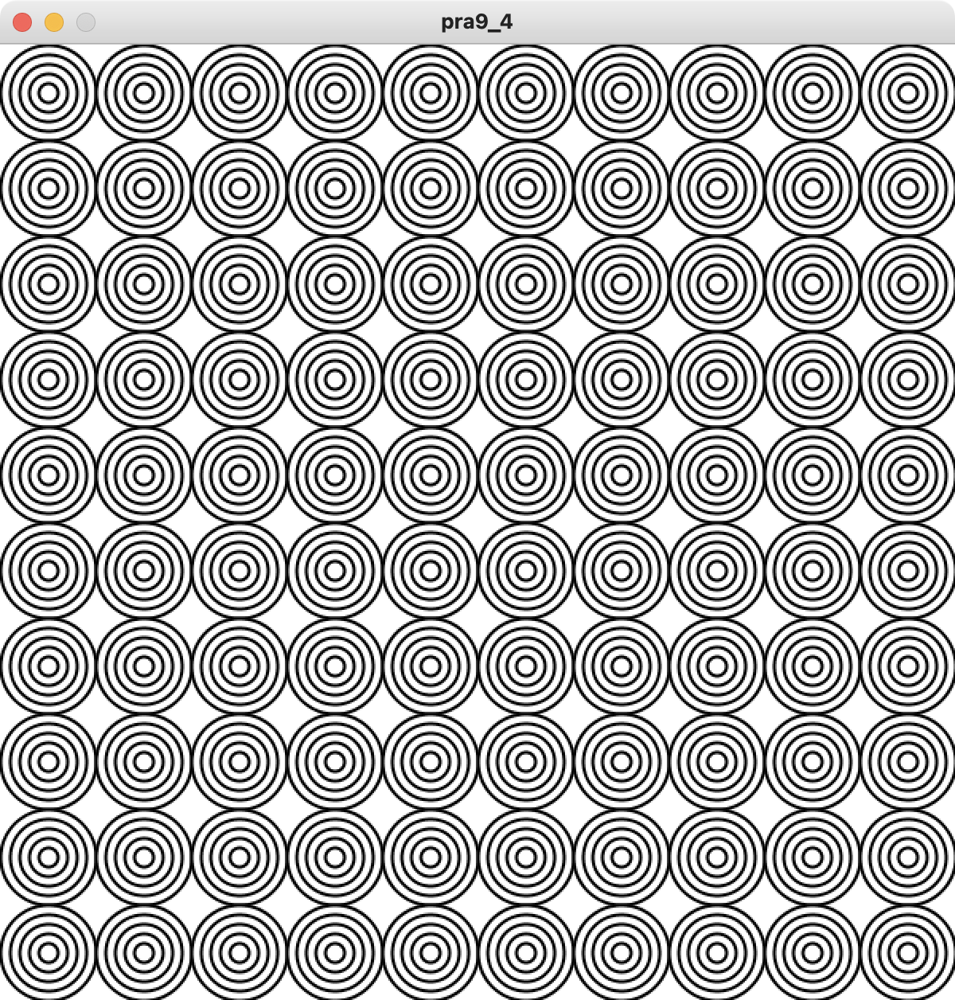
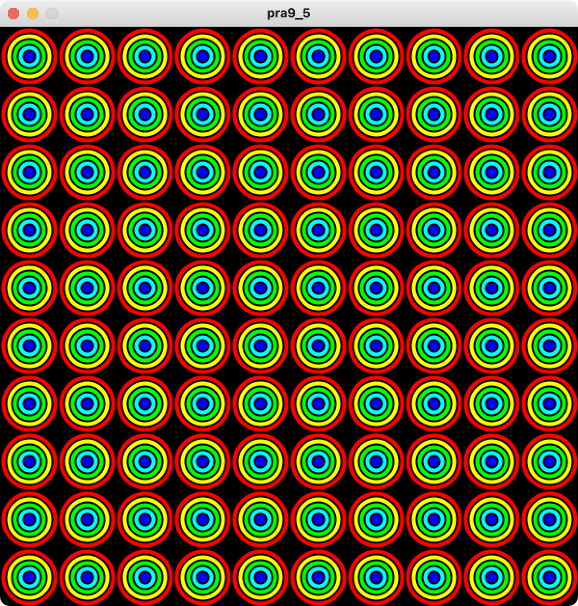

# 第9回目
## 繰り返し処理（発展編）

### 2重ループ
- 繰り返し処理の中に，繰り返し処理を記述することで，より複雑なプログラムを書くことが出来る
- 2重ループの場合，内側にある繰り返し処理を，外側にあるループで設定した繰り返しで実行する
- 選択処理を加えることで，より複雑な処理を行うことができる

```python
# 復習プログラム
size(660, 660)
colorMode(HSB, 360, 100, 100)

for i in range(11):
    for j in range(11):
        fill(0, 10*j, 10*i)
        rect(j*60, i*60, 60, 60)
```

### 2重ループを使用したアニメーションの練習
```python
# サンプルプログラム1
k = 0
def setup():
    size(600, 600)
    background(255, 255, 255)
    frameRate(5)

def draw():
    global k
    noStroke()
    for i in range(10):
        for j in range(10):
            if k == j:
                fill(255, 255, 255)
            else:
                fill(0, 0, 0)
            rect(j*60, i*60, 60, 60)
    k = (k + 1) % 10
```

```python
# サンプルプログラム2
k = 0
def setup():
    size(600, 600)
    colorMode(HSB, 360, 100, 100)
    background(0, 0, 100)
    frameRate(5)

def draw():
    global k
    noStroke()
    for i in range(10):
        for j in range(10):
            if k == j:
                fill(k*24, 100, 100)
            else:
                fill(0, 0, 100)
            rect(j*60, i*60, 60, 60)
    k = (k + 1) % 10
```

```python
# サンプルプログラム3
k = 0
def setup():
    size(600, 600)
    colorMode(HSB, 360, 100, 100)
    background(0, 0, 100)
    frameRate(5)

def draw():
    global k
    background(0, 0, 100)
    noStroke()
    for i in range(10):
        for j in range(k+1):
            fill(j*24, 100, 100)
            rect(j*60, i*60, 60, 60)
    k = (k + 1) % 10
```

```python
# サンプルプログラム4
k = 0
def setup():
    size(600, 600)
    background(255, 255, 255)
    frameRate(5)

def draw():
    global k
    noStroke()
    for i in range(10):
        for j in range(10):
            if k == 9 - j:
                fill(255, 255, 255)
            else:
                fill(0, 0, 0)
            rect(j*60, i*60, 60, 60)
    k = (k + 1) % 10
```

```python
# サンプルプログラム5
k = 0
def setup():
    size(600, 600)
    background(255, 255, 255)
    frameRate(5)

def draw():
    global k
    noStroke()
    for i in range(10):
        for j in range(10):
            if k == i + j:
                fill(255, 255, 255)
            else:
                fill(0, 0, 0)
            rect(j*60, i*60, 60, 60)
    k = (k + 1) % 20
```

```python
# サンプルプログラム6
k = 0
def setup():
    size(600, 600)
    colorMode(HSB, 360, 100, 100)
    background(0, 0, 100)
    frameRate(5)

def draw():
    global k
    noStroke()
    for i in range(10):
        for j in range(10):
            if k == i + j:
                fill(k*18, 100, 100)
            else:
                fill(0, 0, 100)
            rect(j*60, i*60, 60, 60)
    k = (k + 1) % 20
```

```python
# サンプルプログラム7
# マウスを押している状態・話している状態で変化
k = 1
def setup():
    size(600, 600)
    colorMode(HSB, 360, 100, 100)
    background(0, 0, 100)
    frameRate(5)

def draw():
    global k
    background(0, 0, 100)
    for i in range(k):
        for j in range(k):
            fill(j*(300/k), 100, 100)
            rect(j*(width/k), i*(height/k), (width/k), (height/k))
    if mousePressed:
        k = k + 1
    else:
        k = k - 1
    k = constrain(k, 1, 6)
```

### 多重ループ
- 二重ループ，三重ループ，･･･，などのループのことを多重ループとよぶ
  - 一般的に三重ループ以上の多重ループの処理は時間がかかる
  
```python
# サンプルプログラム8
size(600, 600)
colorMode(HSB, 360, 100, 100)
background(0, 0, 100)
strokeWeight(5)

for i in range(5):
    for j in range(5):
        for k in range(5):
            rect(j*120+12*k, i*120+12*k, 120-24*k, 120-24*k)
```

```python
# サンプルプログラム9
size(600, 600)
colorMode(HSB, 360, 100, 100)
background(0, 0, 100)
strokeWeight(5)

for i in range(5):
    for j in range(5):
        for k in range(5):
            stroke(60*k, 100, 100)
            rect(j*120+12*k, i*120+12*k, 120-24*k, 120-24*k)
```

### 練習問題
- サンプルプログラムを参考に，多重ループなどを利用して，以下のプログラムを書きなさい
    1. サイズ(660, 660)の画面に対し，以下の出力を行うプログラム
    
    - ヒント: 青色のHは240である
  
     

    2. サイズ(600, 600)の画面に対し，以下の出力を行うアニメーションプログラム
       - 2A: 上から下に黄色領域が移動する（ループ）
       - 2B: 下から上に黄色領域が移動する（ループ）

    

    3. サイズ(600, 600)の画面に対し，以下の出力を行うアニメーションプログラム
        - 全色塗りおえたら，ループすること

        

    4. サイズ(600, 600)の画面に対し，以下の出力を行うプログラム
    

    5. サイズ(600, 600)の画面に対し，以下の出力を行うプログラム
    
