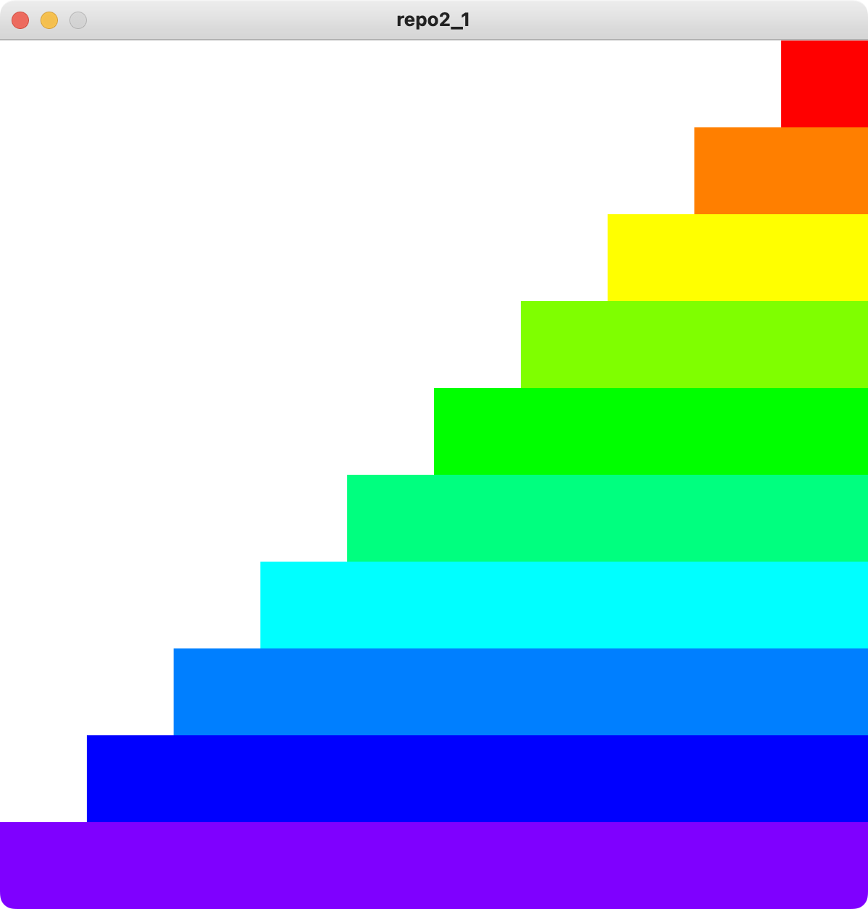
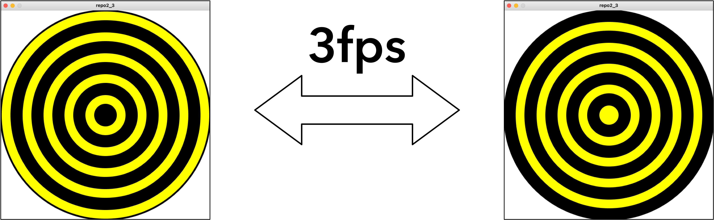

# 2024 情報システム実習 レポート2
## 締め切り: 2024/06/25

### 以下の文章を満たすProcessing-Pythonプログラムを作成してください．

1. 2重ループを利用して以下の図を書きなさい（画面サイズは600, 600とする）
    - 赤の色相Hは0, 紫の色相Hは270である

2. 以下のアニメーションを作成しなさい．（画面サイズは600, 600とする）

3. 以下の図を3fpsで繰り返すアニメーションを作成しなさい．（画面サイズは600, 600とする）

